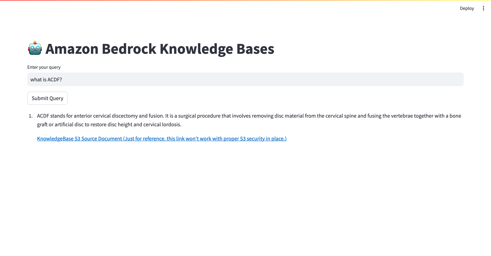

# Amazon Bedrock Knowledge Bases

🛑 &#x1F449; NOTICE: Use at your own risk! &#x1F448; 🛑

The code provided here is for educational/example purposes only. It is provided "as is" without warranty of any kind. Use at your own risk. The author accepts no liability for any damages or losses resulting from its use.


##### IMPORTANT NOTES
1. Edit setup-environment.sh as you may have to remove the "3" in python3 and pip3 depending on your system
2. Run "chmod +x setup-environment.sh" in your terminal
3. Run "source ./setup-environment.sh" in your terminal
4. Authenticate with AWS and then run "streamlit run [PYTHON-APP-FILE-NAME].py" in your terminal.  A browser window/tab will appear with the application.

---

##### Knowledge Bases for Amazon Bedrock
- How-To: https://community.aws/content/2ZTXbwuRvH5gcwQczLXYgjQ0rpU/how-to-started-with-knowledge-bases-for-amazon-bedrock?lang=en
- User Guide: https://docs.aws.amazon.com/bedrock/latest/userguide/knowledge-base.html

---

#### Code specific instructions
1. You'll need to create a knowledge base according to the instructions/guides at the links above.
2. Once you have one, you'll need the Knowledge Base ID - ***NOT the Datasource ID - the "Knowledge Base ID" itself.***
3. Once you have that Knowledge Base ID, look at the file "bedrock-knowledge-base-app.py," specifically line 21
   ``` KNOWLEDGE_BASE_ID = "ABCDEFGHIJ" ```  Replace the letters with your Knowledge Base ID.
4. This example uses the Knowledge Bases for Amazon Bedrock "Retrieve and Generate" method.  You can read more about it in the SDK Docs, here's the link for Python:  https://boto3.amazonaws.com/v1/documentation/api/latest/reference/services/bedrock-agent-runtime/client/retrieve_and_generate.html (The Knowledge Base method are apart of the Agents for Amazon Bedrock boto3 runtime.)
5. Now take a look at line 26.  You don't have to change this, but if you want to look at how other Amazon Bedrock Foundation Models perform, change it to the ARN for that Foundation Model.  In this case I've used Anthropic's Claude Instant v1.  In the code there are comments on lines 24 and 25 that guide you to an example of how these ARNs are constructed.  Again you can leave this alone to see the demo in action.

---

### Screenshot of Bedrock Knowledge Base Application Experience

